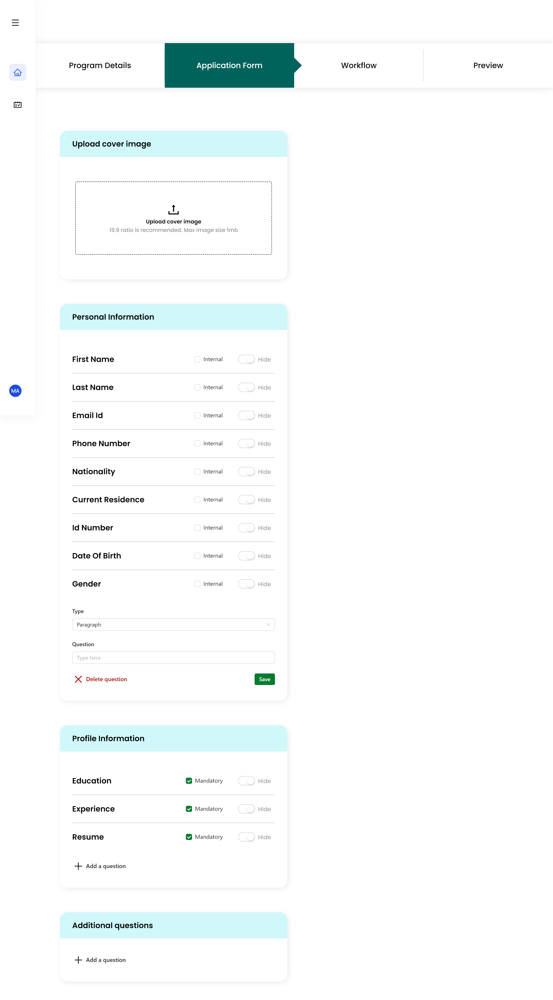
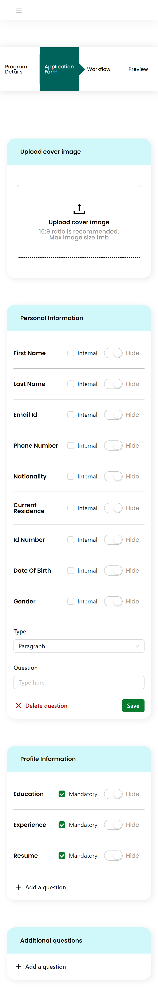

# Capital Placement - Application form

This is a solution to Capital placement technical assessment (task-1).

## Table of contents

- [Overview](#overview)
  - [The challenge](#the-challenge)
  - [Screenshot](#screenshot)
  - [Links](#links)
- [My process](#my-process)
  - [Built with](#built-with)
- [Author](#author)
- [Acknowledgments](#acknowledgments)

## Overview

### The challenge

Users should be able to:

- View the optimal layout for the site depending on their device's screen size
- Update cover image
- Preview the uploaded image
- Add, Edit and Delete questions
- Question form's fields changes depending on question type

### Screenshot

### Links

- Live Site URL: [Application form](https://ats-form-mohamedagina.vercel.app/)

### To Run it locally

- In your root directory create ".env" file
- Define a variable and call it "REACT_APP_BASE_URL={Your Api url}"
  for example `REACT_APP_BASE_URL=http://127.0.0.1:4010/api/918.8516051839101/programs/et/application-form`

## My process

### Built with

- Semantic HTML5 markup
- CSS custom properties
- Flexbox
- Grid
- [React](https://reactjs.org/) - JS library
- [Redux toolkit](https://redux-toolkit.js.org/) - JS library
- [Ant design](https://ant.design/) - UI library

## Author

- LinkedIn - [@mohamedagina](https://www.linkedin.com/in/mohamed-agina/)
